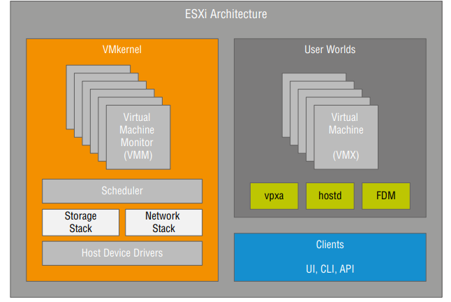

1. overview

2. VMware ESXI Architecture

3. Planning a VMware vSphere Deployment

4. Deploying VMware ESXI

5. Performing post installation configuration

Vmware ESXI Architecture
    
The components of ESXI :

1. VmKernel : It is the heart of ESXI Os, it is responsible for resource Management, scheduling and running VM and starting the processes needed for host management

2. VMM(Virtual Machine Monitor) : it is a process running inside the vmkernel, it virtualizes the guest OS instructions, and manages guest OS memory. The VMM sends storage and network requests to the VMKernel and passes all other requests to the VMX process. There is a VMM process for each virtual CPU in every virtual Machine

3. Resource Scheduler : It is also sits inside the vmkernel. The responsibilities of Resource scheduler include taking the resource requests from VMM and VMX and scheduling the resources from the underlying physical hardware . It has direct access to the physical hardware through the storage and network stacks to the host device drivers.

4. User World Space : A Non-kernel process to execute. This allows non-privileged execution of tasks to help ensure the integrity of the OS.  There are so many process running on User world Space. Two of the most important onces are 1. Hostd and 2. VMX

    1. VMX : VMX stands for single Virtual machine Execution (VMX) helper process running in the user world space. It controls the KMS(Keyboard, mouse, screen); remote console and some non-critical I/O operations like CD-ROM . This process works in conjunction with the VMM processes to Provide each VM's functionality to the administrator.

  2. Hostd : It is a proxy for vmkernel. All graphical and command line interface (CLI) and application programming interface (API) calls are routed to the appropriate VMX or kernel process through hostd. These instructions might come from vSphere host client, PowerCLI instruction, or vCenter server itself. All instructions reach the VMKernel through hostd.

Planning a Vsphere Deployment :
        1. Choosing Server Platform	Which Server is right ?        The answer to this question Depends on many factors . The number of CPU cores is often used as a determining factor, but you should also consider the total number of RAM slots. A Higher number of RAM slots means that you can use lower-cost, lowerdensity RAM modules and still reach high memory configurations. We should also consider server expansion options such as number of available peripheral Component interconnect Express(PCIe) buses, expansion slots, and the types of expansion cards supported in the server.  If you are looking to use converged storage in your environment, such as vSAN, the number of local drive bays and the type of storage controller are other considerations. Finally be sure to consider the server form factor; Blade servers have advantages and disadvantages when compared to rack-mount servers
            Determining a storage Architecture	The Lion's share of advanced features within vsphere features like vSphere DRs, vSphere HA, and vSphere Ft - depends on the presense of shared storage architecture.  Vsphere's dependency on shared storage makes choosing the correct storage architecture for your deployment as critical as choosing the server hardware on which to run ESXI. Vsphere supports storage based on Fibre channel and Fibre channel over Ethernet (FCOE), ISCSI- based storage, and storage accessed via network file system (NFS). In addition vsphere supports the use of multiple storage protocols within a single solution so that one portion of the vsphere implementation might run over Fibre channel and another portion runs over NFS. This provides a great deal of flexibility in choosing your storage solution. 
            Integrating with Network Infrastructure	this decision is driven by the choice of server hardware and the storage protocol.
                
                        Ø ESXI management network needs at least one NIC . 
                        Ø vMotion Needs a NIC
                        Ø vSphere FT needs a NIC
                        Ø For Deployment Using ISCSI, NFS or VSAN, atleast one More NIC, preferable two is needed.
                        Ø  Two NICs are needed for traffic originating from the VM's themselves. Gigabit Ethernet or Faster is strongly recommended for VM Traffic
                        
                        In total we need 8 NICs per server (again assuming management and vMotion share a pair of NICs).
            
            
Deploying Vmware ESXI
    
    1. Interactive installation of ESXI
    2. Unattended (scripted) installation of ESXI
    3. Automated Provisioning of ESXI

Interactive installation of ESXI :
-------------------------------------
Perform the following steps to interactively install ESXi                      1. ensure that your server hardware is configured to boot from the CD-ROM/DVD Drive
    2. Ensure that Vmware ESXI installation Media is available to the server.
    3. Power on the server
    4. Press enter to boot the esxi installer
    5. At the End User License Agreement (EULA) screen, press F11 to accept the EULA and continue with installation
    6. Next, the installer will display a list of available disks on which you can install or upgrade ESXI
    7. To get more information about a device, highlight the device and press F1
    8. Use the arrow keys to select the device on which you are going to install ESXI and press Enter
    9. If the selected device includes a VMFS datastore or an installation of ESXI, you'll be prompted to choose what action you want to take.
        a. Upgrade ESXi, preserve VMFS datastore
        b. Install ESXI, preserve VMFS Datastore
        c. Install ESXI, Overwrite VMFS Datastore
    10. Select the desired keyboard layout and press Enter
    11. Enter ( and confirm) a password for the root account. 
    12. At the final confirmation screen, press F11 to proceed with installation of ESXI
    13. Press Enter to reboot  the host at the installation complete screen.

Performing an Unattended installation of Vmware ESXi :
-------------------------------------------------------
ESXI supports the use of an installation script (often referred as a kickstart, KS, script) that automates the installation routine. By using installation script, users can create unattended installation routines that make it easy to quickly deploy multiple instances of ESXI.

If you want to use this default install script to install ESXi, you can specify it when booting the VMware ESXi installer by adding the ks=file://etc/vmware/weasel/ks.cfg boot option

Using an installation script to install ESXi not only speeds up the installation process but also helps to ensure the consistent configuration of all your ESXi hosts.

Deploying Vmware ESXI with vSphere Auto Deploy :
------------------------------------------------
vSphere Auto Deploy is a network deployment service that enables ESXI hosts to be built off an image template over a network connection. No mounting of installation media is required to get an ESXI host up and running if it is installed using Auto Deploy .                                            

vSphere Auto deploy can be configured with one of three different modes :
    1. Stateless [You deploy ESXi using Auto Deploy directly into server memory, there is no need for the server’s local disk or SAN boot LUN.]
    2. Stateless Caching [You deploy ESXi using Auto Deploy directly into server memory, but the image is cached on the server’s local disk or SAN boot LUN.]
    3. Stateful install [, is similar to Stateless Caching except the server’s boot order is reversed: local disk first and network second. Unless the server is specifically told that it needs to network boot again, the Auto Deploy service is no longer needed]

Auto Deploy Dependencies :
---------------------------------------
    Ø Auto deploy uses a set of rules (called Deployment Rules) to control which hosts are assigned a particular ESXI image (called an Image profile). Deploying a new ESXI image is as simple as modifying the deployment rule to point that physical host to a new image profile and then rebooting with the PXE/Network boot option. When the host boots up, it will receive a new image profile.
    
    Pre-requisites of Auto Deploy :
    -------------------------------------------------
    1. You must setup vcenter server and enable the vSphere Auto Deploy Service. This is the service that stores the image profiles
    2. You must set up and configure a Trivial File Transfer Protocol (TFTP) server on your network
    3. A DHCP server is running on your network, configured to pass the correct TFTP information to hosts booting up.
    4. You must create an image profile using the new AutoDeploy UI
    5. Finally, you must also create a deployment rule that assigns the image profile to a particular subset of hosts.
    

Performing post installation configuration :
-------------------------------------------------------
Reconfiguring the Management Network :

        Ø During the installation of ESXi, the installer creates a virtual switch—also known as a vSwitch— bound to a physical NIC. The tricky part, depending on your server hardware, is that the installer might select a different physical NIC than the one you need for correct network connectivity
            The fix for it is to unplug the network cable from the current Ethernet port in the back of the server and continue trying the remaining ports until the host is accessible, but that's not always possible or desirable. 
            The better way is to use the DCUI to reconfigure the management network so that it is converted the way you need it to be configured.
            
            Perform the following  steps to fix the management NIC in ESXI using the DCUI :
                1. Access the console of the ESXI host, either physically or via remote console solution such as an IP-based KVM
                2. On the ESXI home screen, press F2 for customized System/view logs. If password has been set, enter that root password.
                3. From the system customization menu, select configure management network and press enter
                4. From the configure management network menu, select Network adapters and press Enter
                5. Use the spacebar to toggle which network adapter or adapters will be used for the system's management network. Press enter when finished.
                6. Press ESC to exit the configuration management network menu. When prompted to apply change and restart the management network, press Y.
                7. Press ESC to log out of the system customization menu and return to the ESXI home screen

Using the vSphere Host Client

- each ESXi host has a built-in web-based UI called the vSphere Host Client. There is no client to install, and there’s nothing to set up; it’s running as soon as the host is online. Using the vSphere Host Client to administer an ESXi host requires authentication with a user account that exists on that specific host, whereas connecting to a vCenter Server installation relies on Single Sign-On used for authentication.

Configuring Time Synchronization
        

        Ø Time synchronization in ESXi is an important configuration because the ramifications of incorrect time run deep. Although ensuring that ESXi has the correct time seems trivial, time-synchronization issues can affect features such as performance charting, SSH key expirations, NFS access, backup jobs, authentication, and more
        
        The simplest way to configure time synchronization for ESXi involves the vSphere Host Client. Perform the following steps to enable NTP using the vSphere Host Client:
        
        1. Use web browser and navigate to your ESXI host IP address of FQDN
        2. The host is already selected in the Navigator Tree on the left, simply click on the manage label beneath your host
        3. Select time and date from the system tab on the right side of the UI.
        4. Click on the Edit settings link
        5. In the Edit time configuration dialog box, select Use Network Time Protocol (enable NTP client)
        6. Still in the Time configuration dialog box, select "start and stop with Host". This will ensure the NTP client loads every time ESXI boots up.
        7. Within the NTP servers dialog box, add one or more NTP servers to the list
        8. Click ok to return to the vSphere Host client. The time & date configuration area will update to show the new NTP sever

    Using the vSphere client to enable NTP this way also automatically enables NTP traffic through the firewall. You can verify this by noting an Open firewall ports entry in the Tasks pane or by clicking security profile under the software menu and selecting entry for NTP client listed under outgoing connections.
    
    Configuring Name Resolution :
    
    Ø Just like time synchronization name resolution is also important in vsphere environment.
    Ø Some of the functions may not work as expected without proper name resolution.
    
    Process to configure Name resolution :
    1. Use the vSphere Desktop client to connect directly to the ESXI host.
    2. With the hostname already selected in the inventory tree on the left, click on networking label in Navigator
    3. Click on TCP/IP stacks tab from the right side of the UI
    4. Select the TCP/IP stack called "Default TCP/IP stack" and then click the EDIT settings button
    5. In the EDIT TCP/IP configuration dialog box, add the IP address of your DNS server(s) and any relevant search domains

